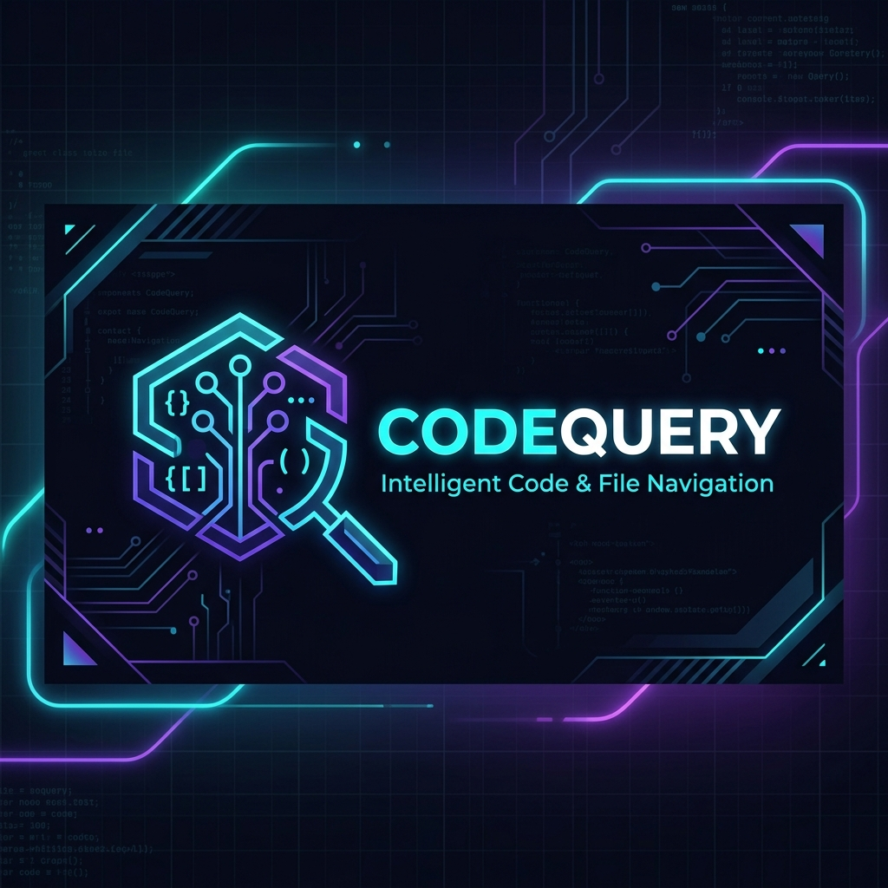
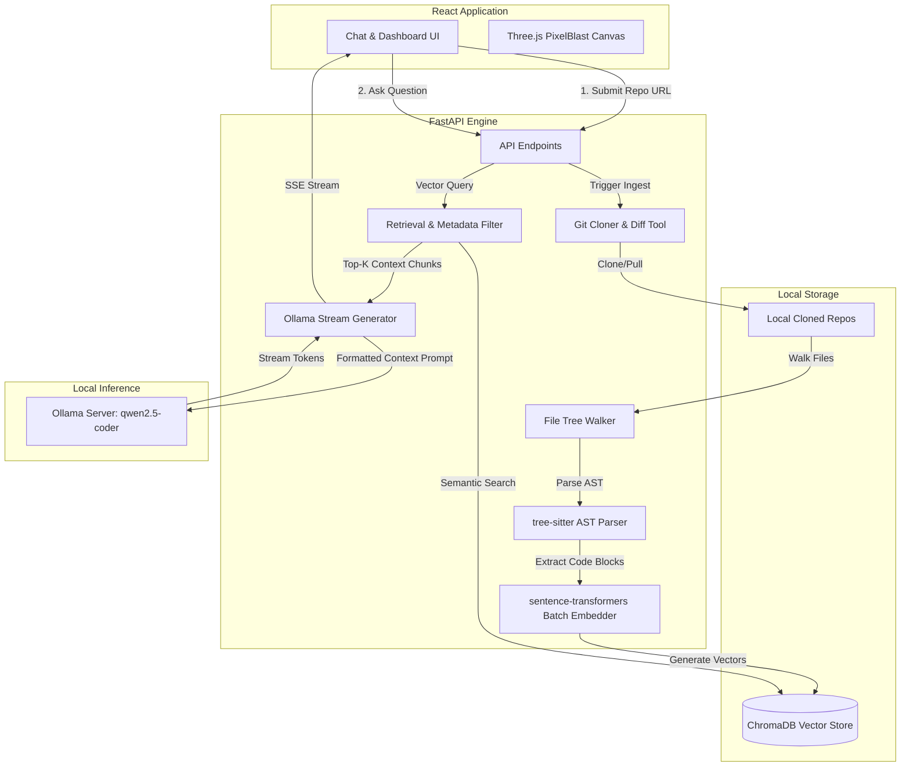

<p align="center">
  
</p>

<p align="center">
  <strong>Ask  questions about any public GitHub repository, and get grounded, accurate answers backed by exact file paths and line-level citations.</strong>
</p>

<p align="center">
  <a href="https://python.org"></a>
  <a href="https://nodejs.org"></a>
  <a href="https://ollama.ai"></a>
  <a href="https://github.com/chroma-core/chroma"></a>
  <a href="https://opensource.org/licenses/MIT"></a>
</p>

<hr />

## 🌟 Overview

**CodeQuery** is a privacy-first, fully local Retrieval-Augmented Generation (RAG) engine designed for codebase understanding. Paste a repository URL, and CodeQuery will clone it, build an Abstract Syntax Tree (AST) to extract logical code segments, embed them using high-performance local models, and store them in a persistent vector database.

When you chat with CodeQuery, it retrieves the most relevant semantic code blocks and generates precise answers with inline citations (e.g. `src/auth.py:42-67`). **Everything runs locally on your machine — zero paid APIs, zero third-party telemetry, and complete code privacy.**

---

## 🚀 Key Features

*   🌳 **AST-Aware Smart Chunking**: Naive line-splitting breaks functions or class blocks mid-way, making them useless for context. CodeQuery uses `tree-sitter` to parse code structure and sets chunk boundaries around complete classes, functions, and methods.
*   🔐 **100% Privacy & Local Execution**: Harnesses [Ollama](https://ollama.ai) for local generation and `sentence-transformers` for local vector embeddings. No cloud APIs, no data leaks, no internet required once setup is complete.
*   ⚡ **Structured Metadata Filtering**: Built on top of [ChromaDB](https://www.trychroma.com/), allowing immediate metadata-filtered queries by programming language, file path, or AST node type without needing parallel indexes.
*   🎨 **Immersive Developer UI**: Features a beautiful Vite + React interface complete with dynamic 3D background elements (powered by Three.js/PixelBlast), real-time indexing progress, and clean citation cards with syntax-highlighted code.
*   📈 **Real-Time Diagnostics**: Health check systems inspect backend connectivity, local model warming, and system statuses dynamically.

---

## 📐 System Architecture

CodeQuery is split into an asynchronous FastAPI backend and a high-fidelity React frontend. Below is the end-to-end data ingestion and querying architecture:



---

## ⚡ Technical Decisions & Rationale

### 1. Why Tree-Sitter for Chunking?
Traditional chunking algorithms use arbitrary character limits or line counts, splitting functions in half. CodeQuery maps files to an Abstract Syntax Tree (AST), ensuring code components (functions, classes, decorators) are chunked as atomic, complete semantic blocks. Fallback sliding-window chunking is only used for files without AST support (marked as `chunk_type="fallback"`).

### 2. Why Ollama with `qwen2.5-coder:7b`?
- **Instruction Following**: Demonstrates outstanding compliance with system prompts requiring exact file path and line citations.
- **Speed vs. Quality**: A 7B parameter code model achieves a fast time-to-first-token (~2–4s) on consumer GPUs compared to sluggish 14B+ models, while significantly outperforming 3B models which suffer from frequent hallucinations.
- **Offloadable**: Runs seamlessly locally using Ollama's efficient llama.cpp-based inference backend.

### 3. Why ChromaDB instead of FAISS?
ChromaDB provides native, rich metadata filtering. When querying, we can restrict search targets to specific programming languages, directory paths, or AST block types (e.g. only functions). FAISS requires building and maintaining secondary indexes to achieve similar filtering capabilities.

---

## 🛠️ Installation & Setup

### Prerequisites
1. **Python 3.10+** (with virtualenv tool)
2. **Node.js 18+**
3. **Git** (configured in your system `PATH`)
4. **Ollama**: [Download & Install Ollama](https://ollama.ai). Once installed, run:
   ```bash
   ollama pull qwen2.5-coder:7b
   ollama serve  # Keep this terminal running in the background
   ```

---

### Backend Setup

#### 💻 Windows (PowerShell)
```powershell
# Navigate to the backend directory
cd backend

# Create and activate virtual environment
python -m venv .venv
.\.venv\Scripts\Activate.ps1

# Install requirements
pip install -r requirements.txt

# Start the server
uvicorn app.main:app --host 0.0.0.0 --port 8000
```

#### 🐧 Linux / macOS (Bash)
```bash
# Navigate to the backend directory
cd backend

# Create and activate virtual environment
python -m venv .venv
source .venv/bin/activate

# Install requirements
pip install -r requirements.txt

# Start the server
uvicorn app.main:app --host 0.0.0.0 --port 8000
```

*Note: You can also use the helper scripts `start.bat` (Windows) or `start.sh` (Linux/macOS) in the repository root to automate environment creation and startup.*

---

### Frontend Setup
In a new terminal window:
```bash
# Navigate to the frontend directory
cd frontend

# Install UI packages
npm install

# Run the dev server
npm run dev
```
Open **[http://localhost:5173](http://localhost:5173)** in your browser.

---

## ⚙️ Environment Variables

Configure CodeQuery by copying `.env.example` to `.env` in the `backend/` directory:

| Environment Variable | Default Value | Description |
| :--- | :--- | :--- |
| `CQ_DATA_DIR` | `./data` | File path where repositories and database indices are stored. |
| `CQ_OLLAMA_URL` | `http://localhost:11434` | Address where the local Ollama daemon is running. |
| `CQ_OLLAMA_MODEL` | `qwen2.5-coder:7b` | Model used for local reasoning and response generation. |
| `CQ_EMBEDDING_MODEL` | `all-MiniLM-L6-v2` | Embedding model used. Switch to `jinaai/jina-embeddings-v2-base-code` for coding-specific embeddings. |
| `CQ_RETRIEVAL_TOP_K` | `8` | The number of semantic chunks to feed into the LLM context. |
| `CQ_RETRIEVAL_MIN_SCORE`| `0.3` | Minimum cosine similarity score threshold for context inclusion. |

> [!TIP]
> Setting `OLLAMA_KEEP_ALIVE=30m` (as an OS environment variable) keeps the code model pre-loaded in GPU memory, avoiding cold-start delays.

---

## 📊 Performance Metrics

*Benchmarked on a consumer-grade laptop CPU/GPU. You can run benchmarks yourself by executing `python benchmarks/bench.py`.*

| Repository | Code Files | Total Semantic Chunks | Git Clone Time | AST Parse Time | Embedding Time (CPU) | Total Ingest Time |
| :--- | :---: | :---: | :---: | :---: | :---: | :---: |
| **[pallets/click](https://github.com/pallets/click)** | 137 | 1,617 | 1.0s | 1.6s | 107s | **~110s** |
| **[expressjs/express](https://github.com/expressjs/express)** | 174 | 363 | 1.5s | 0.8s | 24s | **~26s** |

*   **Query Latency**: ~0.1s for database retrieval.
*   **Generation Speed**: ~2–4 seconds for time-to-first-token, streaming at 3-5 tokens per second.

---

## ⚠️ Limitations & Scope

1. **Cross-File Context Limits**: The LLM context window sees the top `k` chunks. If a call chain passes through 6 files sequentially, retrieval may miss intermediate files, limiting multi-hop tracking.
2. **Indexing Scale**: Indexing repositories containing >10,000 source files will take 5-15 minutes on CPU. GPU acceleration is highly recommended for massive repositories.
3. **Local Embedding Library Version**: If using Jina Embeddings v2, you must lock transformers (`pip install "transformers<5.0.0"`) to avoid deprecated internal API conflicts.
4. **Public Repository Access**: Currently supports cloning public repositories over HTTPS. Private repository access (using SSH/Personal Access Tokens) is slated for a future update.

---

## 📁 Repository Structure

```
codequery/
├── backend/
│   ├── app/
│   │   ├── main.py              # FastAPI application server entrypoint
│   │   ├── config.py            # Pydantic Configuration loader (.env parser)
│   │   ├── models.py            # Request/Response validation schemas
│   │   ├── routers/
│   │   │   ├── repo.py          # Git clone, AST parsing, and status endpoints
│   │   │   └── chat.py          # RAG querying, citation lookup, and health status
│   │   ├── services/
│   │   │   ├── cloner.py        # Local Git clone manager with dirty diff checks
│   │   │   ├── walker.py        # File syntax inspector and tree walker
│   │   │   ├── chunker.py       # AST Tree-Sitter chunker (extracts classes/functions)
│   │   │   ├── embedder.py      # Local SentenceTransformer embeddings manager
│   │   │   ├── indexer.py       # Orchestrator combining Cloner -> Chunker -> Store
│   │   │   ├── search.py        # Cosine distance semantic lookup
│   │   │   └── generator.py     # Local Ollama streaming text generation
│   │   └── store/
│   │       └── chroma_store.py  # ChromaDB wrapper with metadata indexing
│   └── requirements.txt         # Python library dependencies
├── frontend/
│   ├── src/
│   │   ├── App.jsx              # Main dashboard container with PixelBlast overlay
│   │   ├── components/
│   │   │   ├── RepoInput.jsx        # Repository clone interface inputs
│   │   │   ├── IndexingProgress.jsx # Real-time AST parser status graph
│   │   │   ├── ChatInterface.jsx    # Interactive query console
│   │   │   └── CodeCitation.jsx     # Lazy-loaded source code viewer
│   │   └── styles/index.css     # CSS variable tokens and custom theme styling
│   └── vite.config.js           # Vite compilation and proxy configs
├── benchmarks/
│   └── bench.py                 # RAG pipeline performance tester
└── README.md                    # Project documentation
```

---

## 📄 License

This project is licensed under the MIT License - see the [LICENSE](LICENSE) file for details.
